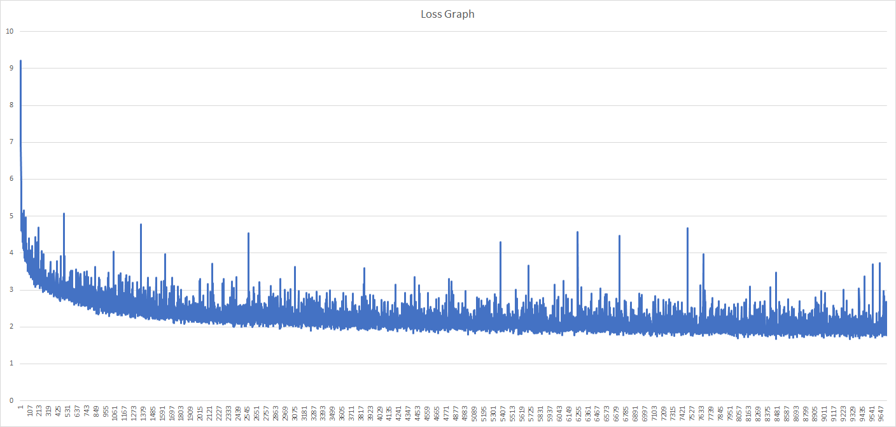
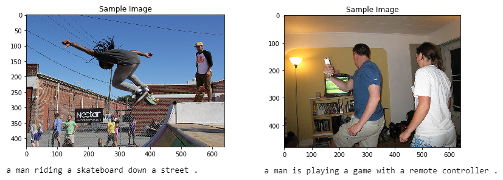

# Image Captioning

## Overview
In this project, I created a CNN-RNN architecture to automatically generate captions from images.

After using the *Microsoft Common Objects in COntext (MS COCO)* dataset to train my network, I tested the network on novel images!

## Working

- [The Dataset notebook](0_Dataset.ipynb) initializes the [COCO API](https://github.com/cocodataset/cocoapi) (the "pycocotools" library) used to access data from the MS COCO (Common Objects in Context) dataset, which is "commonly used to train and benchmark object detection, segmentation, and captioning algorithms." The notebook also depicts the processing pipeline using the following diagram:     
The left half of the diagram depicts the <a href="https://github.com/zainmujahid/Udacity---Computer-Vision-NanoDegree/blob/master/02%20-%20Image%20Captioning/images/encoder.png">EncoderCNN</a>, which encodes the critical information contained in a regular picture file into a "feature vector" of a specific size. That feature vector is fed into the <a href="https://github.com/zainmujahid/Udacity---Computer-Vision-NanoDegree/blob/master/02%20-%20Image%20Captioning/images/decoder.png"> DecoderRNN </a> on the right half of the diagram (which is "unfolded" in time - each box labeled "LSTM" represents the same cell at a different time step). Each word appearing as output at the top is fed back to the network as input (at the bottom) in a subsequent time step, until the entire caption is generated. The arrow pointing right that connects the LSTM boxes together represents hidden state information, which represents the network's "memory", also fed back to the LSTM at each time step.

- [The Preliminaries notebook](1_Preliminaries.ipynb) uses the pycocotools, torchvision transforms, and NLTK to preprocess the images and the captions for network training. It also explores the EncoderCNN, which is taken pretrained from [torchvision.models, the ResNet50 architecture](https://pytorch.org/docs/master/torchvision/models.html#id3).

- The implementations of the EncoderCNN and the DecoderRNN, can be found in the [model.py](model.py) file.

- In [Training notebook](2_Training.ipynb) one finds selection of hyperparameter values and EncoderRNN training. The hyperparameter selection is explained.

- [The Inference notebook](3_Inference.ipynb) contains the testing of the trained networks to generate captions for additional images. No rigorous validation or accuracy measurement was performed, only sample images were generated.

## Results

After training the model the final **Loss Graph** can be seen below:

Later on, two captions were created using this model as seen below:

