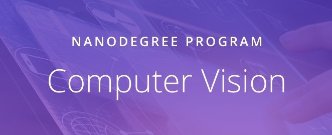

# Computer Vision Nanodegree

This repository contains solutions to my 3 projects related to [Udacity's Computer Vision Nanodegree](https://www.udacity.com/course/computer-vision-nanodegree--nd891)  program. The notebooks lead you through their implementation.

## Honor Code

This Repository created just to show off my work. You are not eligible to **Copy** any **Solution Codes**. This Repository shows respect and values the [Udacity Honor Code](https://www.udacity.com/legal/en-us/community-guidelines)